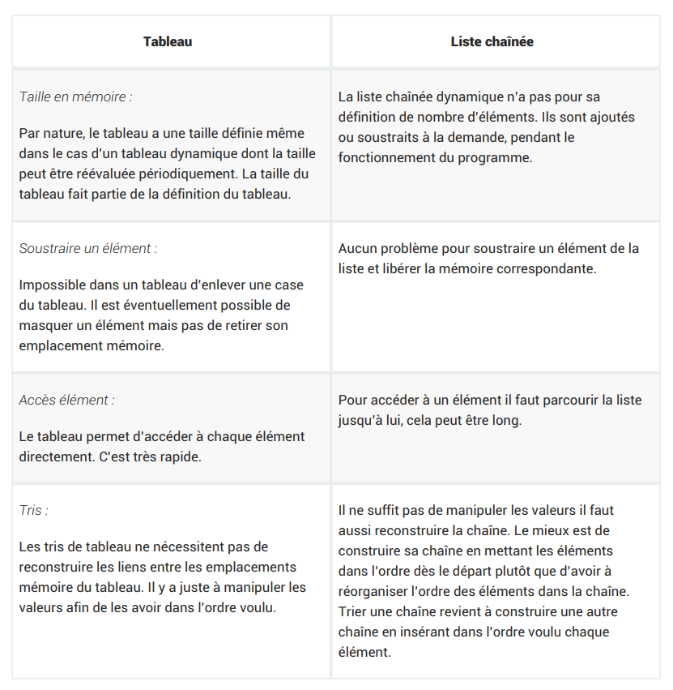
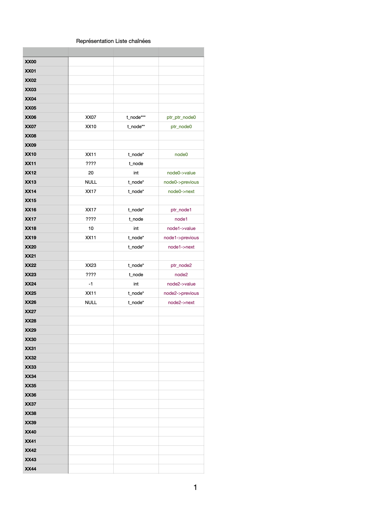
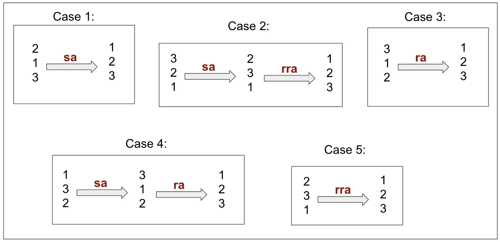

# Push_Swap

# Avant de commencer à coder …

## Choix entre tableaux et liste

Il y a des avantages et des inconvénients dans les 2 cas, en voici un bref récapitulatif.



## A propos des testeurs

Il existe de nombreux testeurs sur github qui permettent de tester son push_swap à la façon d’une francinette. Je conseille d’en utiliser plusieurs afin de s’assurer de la solidité de son code. De plus, chaque correcteur peut choisir un testeur au hasars comme bon lui semble ! Il pourrait choisir un testeur qui détecte des erreurs que d’autres ne détectent pas ! Afin d’éviter cette fâcheuse situation, je conseille d’en utiliser plusieurs afin d’être le plus sûre possible de son code !

- Celui-ci est (indispensable), il vérifie les leaks, tous les cas d’erreur possibles, toutes les combinaisons de 3 et 5 chiffres. Il permet aussi de tester très facilement son push_swap pour des grandes quantité de paramètre (100, 500) et il est trés facile à installer

[GitHub - LeoFu9487/push_swap_tester: This is a tester for school 42 project push_swap, made by yfu from 42LYON.](https://github.com/LeoFu9487/push_swap_tester)

- Celui-ci permet de visualiser en temps étape par étape son algorithme, cela est (indispensable) pour optimiser son algo en fin de projet

[GitHub - anolivei/Push_swap42: Because Swap_push isn't as natural xD](https://github.com/anolivei/Push_swap42)

- Non testé mais semble bien

[GitHub - Yoo0lh/push-swap-tester-42: simple tester for push swap 42 project](https://github.com/Yoo0lh/push-swap-tester-42)

La liste est loin d’être exhaustive !!!

## Représentation des listes chaînées en mémoire



# La gestion des arguments passés en paramètre

Le problème est que le sujet impose de gérer les cas ou :

- l’utilisateur envoie les paramètres entre guillemet : “43 42 899 0 -76 38”
- l’utilisateur envoie les paramètres un par un : 43 42 899 0 -76 38

Cela change tous, car dans le premier cas argc = 2 alors que dans le second cas argc = 7. Le second cas est plus facile à gérer car argv contient un tableau de 7 chaines de caractère. Dans le premier cas argv contient un tableau de 2 chaines de caractère. C’est dans la deuxième chaine de caractère que se trouve tous les arguments !

Il y a évidement plusieurs façon de régler ce problème de gestion des arguments. En ce qui me concerne j’ai choisis la solution suivante de copier les arguments dans la heap sous forme d’un tableau de chaîne de caractère.

- Cas 1 : l’utilisateur a choisis d’utiliser une seule chaîne de caractère, dans ce cas un ft_strdup suivis d’un ft_split. Ainsi j’ai bien un tableau de chaîne de caractère dans la heap
- Cas 2 : je transforme le tableau de chaine de caractère argv en une chaine de caractère qui sera stockée dans la heap. Puis j’effectue un split sur cette chaîne de caractère. Cela peut paraître bizarre au premier abord puisque nous avions déjà un tableau de chaîne de caractère. Alors a quoi bon le transformer en chaine de caractère pour en refaire un tableau ensuite ? La réponse est simple, le but est d’avoir dans la heap exactement la même chose quelque soit la façon dont l’utilisateur a fournit ses paramètres. Cela facilite grandement le traitement des paramètres par la suite ainsi que la gestion des leaks !

Voici la fonction que j’ai développé pour transformer un tableau de chaîne de caractère en une chaine de caractère (une sorte de split inversé) :

```c
char	*ft_join_args(int argc, char *argv[])
{
	int		i;
	char	*result;
	char	*temp;

	i = 1;
	result = ft_strdup(argv[1]);
	while (i < (argc - 1))
	{
		temp = ft_strdup(result);
		free(result);
		result = ft_strjoin(temp, " ");
		free(temp);
		temp = ft_strdup(result);
		free(result);
		i++;
		result = ft_strjoin(temp, argv[i]);
		free(temp);
	}
	return (result);
}
```

 

Ensuite il faudra développer les fonctions qui permettent de vérifier que les arguments passés en paramètre sont valides, voici la liste des critères donnés par le sujet :

- uniquement des nombres, c’est à dire pas d’autres caractères que : + - 0 1 2 3 4 5 6 7 8 9. Attention +12 est un paramètre valide !
- les nombres doivent être compris entre INT_MIN et INT_MAX
- Il ne doit pas y avoir de doublons dans la liste

Si ces critères ne sont pas respectés le programme doit renvoyer “Error” sur la sortie d’erreur ! Pour cela il faut mettre 2 en premier paramètre de la fonction write : `write(2, “Error\n”, 6)`.

Voici la fonction que j’ai développé pour vérifier qu’il s’agit bien d’un nombre :

```c
int	ft_check_number(char *str)
{
	int	i;

	i = 0;
	if (ft_strlen(str) == 0)
	{
		return (0);
	}
	if ((str[i] == '+' && ft_isdigit(str[i + 1]) == 1)
		|| (str[i] == '-' && ft_isdigit(str[i + 1]) == 1))
	{
		i++;
	}
	while (str[i] != '\0')
	{
		if (ft_isdigit(str[i]) == 0)
		{
			return (0);
		}
		i++;
	}
	return (1);
}
```

# La gestion des cas ou le programme ne doit rien renvoyer et rendre l’invite de commande

Cette partie n’est pas très difficile, le programme doit rendre l’invite de commande dans deux cas :

- l’utilisateur n’as pas mis de paramètre : `./push_swap` (1) ou .`/push_swap “”` (2). Attention le exemple peut donner des leaks !
- l’utilisateur a fournit une liste déjà triée : `./push_swap 1 2 3 4 5 22`(3) ou l’utilisateur n’a fournit qu’un seul nombre mais c’est finalement le même cas.

On peut se débarrasser du cas (1) facilement dés le début du main avec :

```c
if (argc == 1)
		return (0);
```

Pour le cas (2), il faudra d’abord vérifier que la chaîne de caractère fournis est bien vide !

Pour le cas (3), une simple fonction vérifiant si le tableau est déjà trié devrait faire l’affaire.

# Le développement des fonctions nécessaires à la manipulation de la pile

C’est une partie critique ! Si ces fonctions sont correctement codées, cela permettra de développer facilement les algorithmes de tri. Si elles ne sont pas suffisamment solides, cela risque de compliquer grandement l’implémentation de la suite !

## La structure

En cas d’utilisation des listes chaînées, je conseille d’utiliser des listes doublement chainées. Voici la structure que j’ai utilisé pour mon projet :

```c
typedef struct s_list
{
	int				value;
	int				ind;
	struct s_list	*previous;
	struct s_list	*next;
}	t_list;
```

## Les fonctions de base pour créer et manipuler la liste chainée

Voici une liste des fonctions de base qui me paraissent indispensables pour créer les piles et pour pouvoir les manipuler ensuite, la plupart d’entre elles sont dans les bonus de la libft. J’ai légèrement modifié leurs prototypes de ceux de la libft pour qu’elle soient utilisables avec ma structure ou plus simples à utiliser  :

| Prototype | Paramètres | Description |
| --- | --- | --- |
| t_list *ft_lstnew(int value) | value : valeur du maillon | Alloue  et renvoie un nouvel élément. La variable membre ’value’ est initialisée à l’aide de la valeur du paramètre. La variable next et previous est initialisée à NULL. |
| void ft_lstadd_front(t_list **lst, t_list *new) | lst: L’adresse du pointeur vers le premier élément de la liste.
new: L’adresse du pointeur vers l’élément à rajouter à la liste. | Ajoute l’élément ’new’ au début de la liste. |
| int ft_lstsize(t_list *lst) | lst: Le début de la liste. | Compte le nombre d’élément dans la liste |
| t_list *ft_lstlast(t_list *lst) | lst: Le début de la liste | Renvoie le dernier élément de la liste |
| void ft_lstadd_back(t_list **lst, t_list *new) | lst: L’adresse du pointeur vers le premier élément de la liste.
new: L’adresse du pointeur vers l’élément à rajouter à la liste. | Ajoute l’élément ’new’ à la fin de la liste |
| void ft_lstdelone(t_list *lst) | lst: L’élément à free | Libère la mémoire de l’élément passé en argument avec free. La mémoire de ’next’ et de ‘previous’ ne doivent pas être free. |
| void ft_lstclear(t_list **lst) | lst: L’adresse du pointeur vers un élément (le premier si pour free toute la liste par exemple) | Supprime et libère la mémoire de l’élément passé en paramètre, et de tous les éléments qui suivent, à l’aide de free. Enfin, le pointeur initial doit être mis à NULL. |

2 fonctions supplémentaires qui seront très utiles pour la suite

| Prototype | Paramètres | Description |
| --- | --- | --- |
| t_list *del_last(t_list **lst) | lst : premier élément de la liste | Cette fonction permet de supprimer le dernier élément de la liste mais sans le free. Elle renvoie l’adresse de cet élément. |
| t_list *del_first(t_list **lst); | lst : premier élément de la liste | Cette fonction permet de supprimer le premier élément de la liste, elle renvoie l’adresse de cet élément |

Si toutes ces fonctions son correctement codées la suite devrait être plus facile. Voici 2 fonctions supplémentaires qui sont indispensables pendant le développement du projet mais qui seront inutiles dans le programme final. Il s’agit des fonctions pour afficher un maillon et une fonction pour afficher toute la liste.

| Prototype | Paramètres | Description |
| --- | --- | --- |
| void display_node(t_list *lst) | lst: L’élément à afficher | Affiche les valeurs des variables de la structure ainsi que l’adresse mémoire de la structure elle même |
| void display_lst(t_list **first_node t, char *name) | first_node : premier élément de la liste name : chaine de caractère pour décrire la lite (par exemple “stack A”) | Utilise display node pour afficher toute la liste |

Voici le code pour ces deux fonctions

```c
#include <stdio.h>

void	display_node(t_list	*lst)
{
    if (lst != NULL)
    {
    	printf("[%p] {value = %d | indice = %d | previous = %p | next = %p}\n", 
											      lst, 
                            lst->value,
                            lst->ind,
                            lst->previous, 
                            lst->next);
    }
}

void	display_lst(t_lst **first_node, char *name)
{
	t_lst	*current_node;
	int		count;

	current_node = *first_node;
	count = 0;
    printf("\n%s :\n", name);
    if (*first_node != NULL)
    {
	    while (current_node->next != NULL)
	    {
		    printf("Index = %d : ", count);
		    display_node(current_node);
		    current_node = current_node->next;
		    count++;
	    }
	    printf("Index = %d : ", count);
	    display_node(current_node);
    }
    else
    {
        printf("The stack is empty.\n");
    }
    printf("\n");
}
```

## Les fonctions utilisables pour le tri de la liste

Chaque règle doit être codée sous forme de fonction. Voici l’ensemble des règles autorisées par le sujet. 

- sa (swap a) : Intervertit les 2 premiers éléments au sommet de la pile a. Ne fait rien s’il n’y en a qu’un ou aucun.
- sb (swap b ) : Intervertit les 2 premiers éléments au sommet de la pile b. Ne fait rien s’il n’y en a qu’un ou aucun.
- pa (push a) : Prend le premier élément au sommet de b et le met sur a. Ne fait rien si b est vide.
- pb (push b) : Prend le premier élément au sommet de a et le met sur b. Ne fait rien si a est vide.
- ra (rotate a) : Décale d’une position vers le haut tous les élements de la pile a. Le premier élément devient le dernier.
- rb (rotate b) : Décale d’une position vers le haut tous les élements de la pile b. Le premier élément devient le dernier
- rra (reverse rotate a) : Décale d’une position vers le bas tous les élements de la pile a. Le dernier élément devient le premier.
- rrb (reverse rotate b) : Décale d’une position vers le bas tous les élements de la pile b. Le dernier élément devient le premier.

### Exemple 1 : la fonction swap

La fonction swap est une combinaison des fonctions précédement codées :

1. On utilise 2 fois la fonction **del_first** afin de supprimer les 2 derniers éléments de la liste (élément 1 et 2)
2. On utilise 2 fois la fonction **add_front** qui ajoute les éléments au début de la liste : d’abord on ajoute l’élément 2 puis on ajoute l’ élément 1.

Et le swap est terminé…

### Exemple 2 : la fonction push_a

1. On utilise del_first sur la liste a
2. On utilise addfront sur la liste b en avec en paramètre l’élément supprimé de la liste a

ATTENTION chacune de ces fonctions ne doit fonctionner que lorsque c’est possible ! Par exemple swap_a ne doit rien faire si il n’y a pas au minimum 2 éléments dans liste !!!!

# Algorithme pour des listes de 2 à 5 éléments

## Indexation

Avant de commencer à trier, il semble indispensable de normalliser les valeurs de la chaîne. Pour cela j’ai utilisé un bubble sort sur le tableau des paramètres et ajouté l’indice de chaque valeur à la variable ind de ma structure. Pour rappel voici le code pour le bubble sort d’un tableau de valeur :

```c
void	ft_sort_int_tab(int *tab, int size)
{
	int	i;
	int	c;
	int	check;

	check = 0;
	while (check < size)
	{
		i = 0;
		while (i < (size - 1))
		{
			if (tab[i] > tab[i + 1])
			{
				c = tab[i];
				tab[i] = tab[i + 1];
				tab[i + 1] = c;
			}	
			i++;
		}
		check++;
	}
}
```

## Trier 3 éléments

Pour cela il n’ y a aps de miracle il faut hard coder les 5 situations. La sixième n’est pas nécessaire car c’est le cas ou les 3 éléments sont déjà triés. La correction impose de le faire en moins de 3 actions.



## Trier 4 éléments

Il y a certainement plusieurs façon de faire, j’ai choisis de le faire en suivant les étapes suivantes :

1. Identifier ou se trouve le 1 dans la liste
2. Effectuer des rotate (ou des reverse rotate) pour placer le 1 au sommet de la liste
3. Pousser le 1 sur la liste B
4. Appliquer l’algorithme pour trier trois éléments sur la liste A
5. Pousser le 1 sur la liste A

Cela garantie de le faire en 7 coups maximums.

## Trier 5 éléments

Je fais exactement de la même façon pour trier 4 éléments. La seule différence réside dans le fait que j’applique l’algorithme pour trier 4 éléments à la quatrième étape.

Cela assure de le faire en 12 maximum comme l’impose la correction.

# Algorithme pour les listes de plus de 5 éléments

A suivre…

# Exigences de la correction

La correction impose d’avoir un algorithme raisonnablement efficace pour accepter le projet. Voici les barèmes :

## Pour 3 et 5 nombres

| 3 nombres | 3 instructions maximum |
| --- | --- |
| 5 nombres | 12 instructions maximum |

## Pour 100 nombres

| Instructions | Points |
| --- | --- |
| <700 | 5 points |
| <900 | 4 points |
| <1100 | 3 points |
| <1300 | 2 points |
| <1500 | 1 points |

## Pour 500 nombres

| Instructions | Points |
| --- | --- |
| <5500 | 5 points |
| <7000 | 4 points |
| <8500 | 3 points |
| <10000 | 2 points |
| <12500  | 1 point |

# Sources

[Analysis of algorithms - Wikipedia](https://en.wikipedia.org/wiki/Analysis_of_algorithms)

[Push_Swap Tutorial](https://medium.com/nerd-for-tech/push-swap-tutorial-fa746e6aba1e)

[Push_Swap: The least amount of moves with two stacks](https://medium.com/@jamierobertdawson/push-swap-the-least-amount-of-moves-with-two-stacks-d1e76a71789a)

[Bubble Sort Algorithm - GeeksforGeeks](https://www.geeksforgeeks.org/bubble-sort/)

[](https://www.rocq.inria.fr/secret/Anne.Canteaut/COURS_C/gdb.html)
